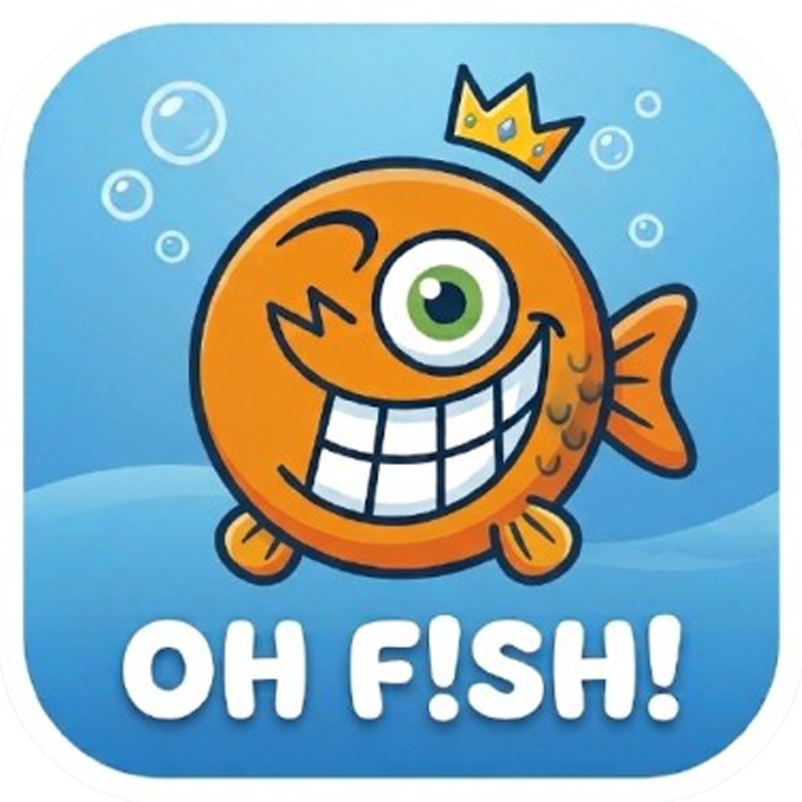

<div align="center">
  

  # 🐟 OH F!SH! - Smart Aquaculture Management & Biomass Calculator App

  **Aplikasi manajemen akuakultur modern untuk efisiensi budidaya kolam, kalkulasi biomassa, log pakan harian, monitoring kualitas air, serta integrasi ekspor nota fisik (Bluetooth/PDF).**

  [](https://reactnative.dev/)
  [](https://expo.dev/)
  [](https://docs.expo.dev/eas/)
  [](https://developer.mozilla.org/en-US/docs/Web/JavaScript)
  [](https://nodejs.org/)
  [](#-fitur-utama-key-features)
  [](#-fitur-utama-key-features)
</div>

---

## 📖 Tentang Aplikasi

**OH F!SH!** adalah aplikasi mobile (Android/iOS) berbasis React Native + Expo yang dirancang untuk membantu peternak ikan/udang/lobster air tawar mengelola operasional budidaya sehari-hari secara digital — mulai dari pencatatan tebar bibit, pakan, sampling berat, kualitas air, hingga panen dan penjualan. Seluruh data tersimpan secara **lokal (offline-first)** menggunakan SQLite, sehingga aplikasi tetap dapat digunakan tanpa koneksi internet di lokasi kolam.

## ✨ Fitur Utama (Key Features)

| Fitur | Deskripsi |
| --- | --- |
| 📊 **Visual Biomass Indicator** | Donut chart animasi yang menampilkan proporsi sisa stok ikan vs. hasil panen, lengkap dengan log panen parsial (partial harvest) per kolam. |
| ⏰ **Daily Feed Schedule & Checklist** | Widget checklist jadwal pakan harian (Pagi/Sore/Malam) dengan auto-timestamp — setiap sesi pakan yang diselesaikan otomatis tercatat jam & realisasi kg pakannya. |
| 🧪 **Water Quality Alert & Smart Recommendation** | Monitoring pH air, suhu, dan kejernihan dengan sistem alert otomatis (mis. rekomendasi pergantian air 20% atau penambahan Dolomit) beserta status penyelesaian tindakan (Pending/Resolved). |
| 🐟 **Sorting & Grading Log** | Pencatatan sortir dan grading ikan antar kolam, dengan transfer populasi otomatis dari kolam asal ke kolam tujuan di database. |
| 🧾 **Bluetooth Thermal Receipt & PDF Export** | Cetak nota transaksi penjualan/pembelian ke printer thermal Bluetooth (format ESC/POS 58mm) maupun sebagai struk PDF, plus laporan budidaya bulanan lengkap. |

### Fitur pendukung lainnya
- Manajemen multi-kolam (bioflok, terpal, kolam tanah, beton, termasuk kolam bertingkat/apartemen).
- Kalkulator HPP, BEP, laba/rugi, dan analisis harga jual vs. harga pasaran lokal.
- Kalkulator pakan alternatif (Maggot BSF, Azolla, Ikan Rucah, Cacing Sutra) dan estimasi penghematan biaya.
- Manajemen stok gudang, alat/inventaris, dan reputasi penjual bibit.
- Dashboard ringkasan laba/rugi dan tren pengeluaran pakan mingguan.

## 🛠️ Tech Stack

- **Framework**: [React Native](https://reactnative.dev/) + [Expo](https://expo.dev/) (SDK 57, Expo Router-free / Tab Navigation via React Navigation)
- **Bahasa**: JavaScript (ES2023)
- **Database**: SQLite lokal (`expo-sqlite`), offline-first
- **Build & Distribusi**: [EAS Build](https://docs.expo.dev/eas/) (Expo Application Services)
- **Cetak & Ekspor**: `expo-print`, `expo-sharing`, generator teks ESC/POS custom untuk printer thermal Bluetooth
- **Visualisasi**: `react-native-svg` (donut chart, sparkline, mini bar chart)
- **Ikon**: `lucide-react-native`

## 🚀 Metode Pengembangan

### Prasyarat
- [Node.js](https://nodejs.org/) ≥ 18 dan npm
- Aplikasi **Expo Go** di HP Android/iOS (untuk mode development), atau emulator Android/iOS
- [EAS CLI](https://docs.expo.dev/eas/) (`npm install -g eas-cli`) untuk keperluan build APK

### 1. Instalasi

```bash
git clone <url-repo-ini>
cd oh-fish
npm install
```

### 2. Menjalankan via Expo Go

```bash
npx expo start
```

Scan QR code yang muncul di terminal menggunakan aplikasi **Expo Go** (Android/iOS) untuk membuka aplikasi secara langsung di perangkat kamu.

### 3. Build APK Android (EAS Build)

```bash
# Login ke akun Expo (sekali saja)
eas login

# Build APK menggunakan profile "preview"
eas build --platform android --profile preview
```

Profile `preview` pada `eas.json` sudah dikonfigurasi untuk menghasilkan output **APK** (bukan AAB), sehingga file hasil build bisa langsung diinstal/dibagikan tanpa melalui Google Play Store.

## 📂 Struktur Proyek Singkat

```
src/
├── components/   # Komponen UI reusable (chart, modal, form, widget)
├── constants/     # Preset data statis (jenis komoditas)
├── db/            # Skema SQLite & query database
├── screens/       # Layar utama (Beranda, Kolam, Keuangan, Stok, Profil)
├── theme.js        # Palet warna & spacing global
└── utils/          # Kalkulator budidaya, formatter, generator PDF/struk
```

## 📄 Lisensi

Proyek ini didistribusikan untuk keperluan internal/komersial pemilik aplikasi. Hubungi pengembang untuk informasi lisensi lebih lanjut.

---

<div align="center">

**Designed & Developed by Haryo Heddy N.**

</div>
